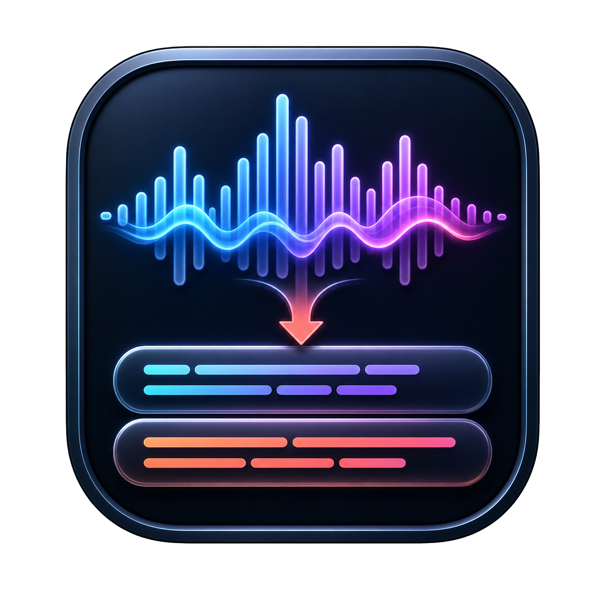
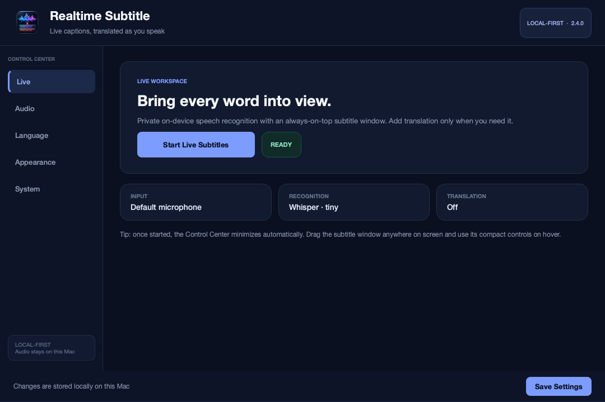
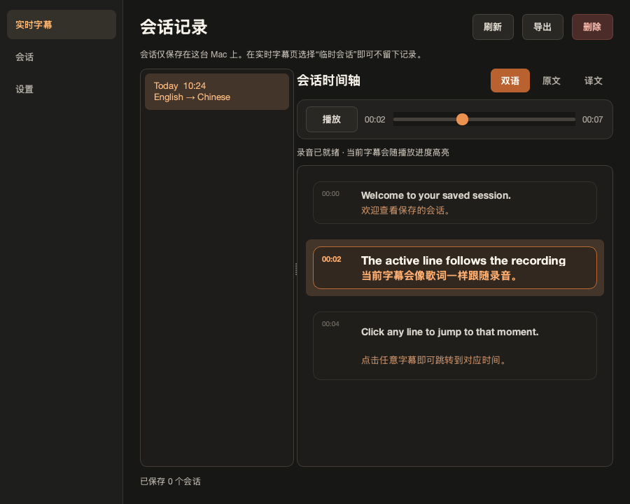
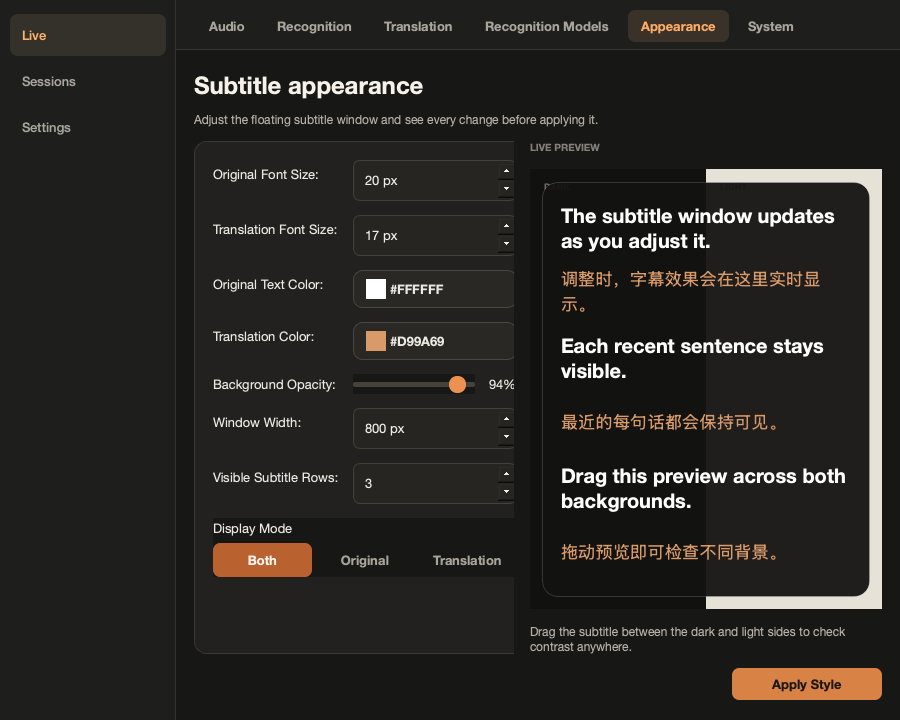
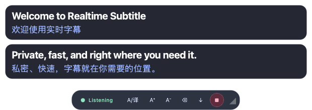

<div align="center">
  
  <h1>Realtime Subtitle</h1>
  <p><strong>让每一句话，都在你眼前。</strong><br>Private, low-latency live captions and translation for macOS and Windows.</p>
</div>



## 下载 / Download

当前稳定版：**v2.11.1** · macOS 13+ / Windows 10 或 11（x64）

Current stable release: **v2.11.1** · macOS 13+ / Windows 10 or 11 (x64)

| 平台 / Platform | 安装包 / Installer | 适用设备 / Hardware |
|---|---|---|
| Windows | [下载 Windows x64 安装程序](https://github.com/Dreaminmaster/realtime-subtitle-product/releases/latest/download/RealtimeSubtitle-2.11.1-windows-x64-setup.exe) | Windows 10 / 11 x64 |
| Apple Silicon | [下载 ARM64 DMG](https://github.com/Dreaminmaster/realtime-subtitle-product/releases/latest/download/RealtimeSubtitle-2.11.1-macos-arm64.dmg) | M1 / M2 / M3 / M4 and newer |
| Intel | [下载 Intel DMG](https://github.com/Dreaminmaster/realtime-subtitle-product/releases/latest/download/RealtimeSubtitle-2.11.1-macos-x86_64.dmg) | Intel-based Macs |
| 校验 / Verify | [SHA256SUMS.txt](https://github.com/Dreaminmaster/realtime-subtitle-product/releases/latest/download/SHA256SUMS.txt) | 三个平台安装包 / all installers |

[查看全部版本 / View all releases](https://github.com/Dreaminmaster/realtime-subtitle-product/releases)

> 当前社区安装包尚未进行商业代码签名。macOS 首次启动若被拦截，请按住 Control 点击 App，选择“打开”；Windows 出现 SmartScreen 时，请先对照 `SHA256SUMS.txt` 校验文件，再选择“仍要运行”。
>
> Community builds are currently unsigned. On macOS, Control-click and choose **Open**. On Windows, verify the SHA-256 checksum before choosing **Run anyway** in SmartScreen.

## 中文说明

Realtime Subtitle 是一款 macOS / Windows 实时字幕应用。语音识别默认在本机完成；原文会先显示，翻译结果随后异步补全，因此翻译服务变慢时也不会阻塞字幕。

### 主要功能

- v2.11.0 新增真正可安装的 Windows x64 版本：自带运行环境、离线依赖、Whisper Tiny 和英中 / 中英基础离线翻译，不要求用户安装 Python。
- v2.11.1 修复 Windows 首次准备完成后主窗口可能静默退出的问题；启动失败现在会保留窗口、展示恢复提示并写入 `app-startup.log`。
- Windows 系统声音使用 WASAPI 回环捕获，可直接选择播放设备，不需要 VB-CABLE，也不会改变系统默认播放路径。
- Windows 悬浮字幕使用原生 `WS_EX_NOACTIVATE` 工具窗口语义：字幕更新保持置顶但不会抢占当前 App、进入 Alt-Tab 或召回控制中心。
- Windows 翻译页不会出现 Apple 专属入口；默认可选内置离线英中翻译，也保留 LM Studio、本地服务与在线 API。其他语言可用 LM Studio / API，避免把大体积多语模型强塞进基础安装包。
- 本地实时语音识别，内置 `faster-whisper tiny` 模型，安装后即可开始。
- v2.10.0 引入 **草稿 → 稳定 → 最终** 三级流式字幕：草稿尽快出现，连续推理一致的前缀会固定，最终段落才写入历史；同一行原位更新，不因滑动窗口重复、闪烁或抢焦点。
- LocalAgreement 思路与语义端点共同工作：短停顿、未完成短语和连接词不会立即断句，长讲话仍会受到时长和词数上限约束。
- 增量翻译只提交稳定前缀，使用防抖、最小增长、单个运行请求与一个最新待处理请求；会话/文本版本变化会让过期结果失效，慢服务不会阻塞识别或 UI。
- 原文与译文会在当前字幕框内自然换行，不会被右侧裁掉；视觉换行仍属于同一条字幕。
- 会话时间轴现在会随窗口宽度重新排版，不再出现底部横向滚动条；长双语内容在窄窗口也能完整阅读。
- Agnes AI 与自定义 OpenAI-compatible 接口合并为“在线 API”及预设；翻译页新增按需下载、校验、选择和删除的轻量英中 / 中英离线模型，并与识别模型明确分区。
- 均衡模式把单段语音控制在九秒以内，上下文合句长度同步收紧；草稿翻译刷新更快，同时保留节能模式控制发热。
- v2.9.3 新增增量实时翻译：讲话中的识别草稿会按“均衡 / 更实时”节奏提前翻译，随后在同一行原位更新；最终定稿仍通过可靠队列覆盖草稿，不会把临时译文写入会话记录。
- Apple Translation 为固定语言组合复用一个原生系统翻译会话，不再为每次更新重新启动框架；连接测试会实际验证当前语言对和已下载系统语言资源，而不是只检查桥接文件是否存在。
- 新增节能 / 均衡 / 高精度三档运行策略。均衡与节能会在耗时的大模型修正后自动冷却并仅保留最新任务；高精度持续运行已启用的修正，但大模型仍需用户按需下载。
- v2.9.2 将增强模型改为字幕启动后在后台加载；慢模型繁忙时只保留最新一句待修正，避免旧任务积压造成长时间发热。实测本机管线准备时间由约 25 秒降至约 1.3 秒。
- Live 页可直接选定**说话语言**。明确的单一语言会跳过反复语言检测，通常比“自动检测”更准确且负担更低；混合语言对话仍可选择自动。
- 音频页新增关闭 / 均衡 / 强力三档自适应环境降噪。它只改进说话起止判断，不改变录音和送入识别模型的原始音频。
- 新增可选的**增强准确率**：当前小模型先即时显示，大模型在后台复听同一段音频，并在原字幕位置修正文字、翻译与保存记录，不会产生重复字幕。
- v2.9.1 修复增强模型下载状态：只有完整、可加载的 faster-whisper 模型才会显示“已安装”，下载按钮会立即显示进行中，并在失败或取消后保留明确反馈。
- 自动根据 Mac 架构与内存推荐增强方案：Intel 使用 `small`，Apple Silicon 使用兼顾准确率与温度的 `turbo`；只有手动选择“高准确率”时才使用 `large-v3`。增强模型仅在开启功能后按需下载，不会增大基础安装包。
- 悬浮字幕窗始终置顶，支持拖动、缩放、双语/仅原文/仅翻译显示。
- 上下文断句会识别短暂停顿后的未完句，在同一条字幕中续接并重新翻译，避免把半句话永久切开。
- 静音断句现在尊重用户设置的完整时长（最高 2 秒），短暂停顿后以小写连接词或进行时开头的英文片段会继续修正上一条字幕。
- 翻译提示把所有输入严格视为“待翻译语音”，问句不会被本地模型误当成聊天请求；异常回答会自动重试并拦截。
- 可自定义屏幕上同时显示的字幕条数；向上滚动可查看本次会话的过往字幕。
- 开始前直接选择结果：**临时字幕 / 保存字幕 / 字幕＋录音**。只有“字幕＋录音”会生成可播放音频，避免结束后才发现没有录音。
- 录音使用 macOS 原生音频播放路径回放。字幕会像歌词一样跟随进度，高亮并放大当前句；点击任意字幕即可跳转到对应声音。未录音的旧会话无法事后补录，App 会明确说明原因。
- 会话字幕改为自适应的连续歌词布局，不再为每句话套气泡，长句和双语文本拥有完整宽度。
- 会话页可随时切换双语、仅原文或仅译文；导出严格针对当前选中的会话，可选择字幕、录音或两者，并按当前查看模式生成字幕文本。
- 外观页提供与悬浮字幕一致的实时预览；选择 1–8 条可见字幕时会显示同等数量的示例句。深色和浅色背景改为上下排列，预览字幕可自由拖动，长句不会再被左右窄栏挤压。文字颜色使用 macOS 原生颜色面板，并与背景透明度互不影响。
- 常用的二到四项选择改为直接可见的分段控件；其余下拉菜单使用应用内紧凑浮层，不再出现白色空框或多余留白。
- 应用界面支持全局中文/English 即时切换，入口位于 **设置 → 系统**。
- 开始字幕后控制中心会完全隐藏，App 切换为 macOS 辅助应用模式，只保留不会抢焦点的悬浮字幕；字幕工具条中的 **主界面 / 隐藏** 可双向切换控制中心。
- 运行时点击控制中心红色关闭按钮只隐藏窗口，不会中断字幕；点击字幕工具条停止按钮会结束会话，`⌘Q` 会完全退出 App。
- Apple 本地翻译、App 内下载的离线模型、LM Studio、本地或在线 OpenAI-compatible API，以及完全关闭翻译。
- macOS 26 及以上可使用 Apple Translation 本地翻译；语言包缺失时 App 会显示安装说明，并可直接打开“语言与地区”设置或 Apple 帮助。
- Apple 翻译连接测试会自动选择不同的测试源语言，避免英文目标被误测为 `en → en`；同语言输入安全直出，缺失语言包的底层错误不会再显示成字幕正文。
- Agnes AI 与任意 OpenAI-compatible 服务共用“在线 API”入口，通过 API 预设切换；LM Studio 和 App 内离线模型保持独立入口。
- 麦克风输入与内置 macOS 系统声音采集，无需 BlackHole 或虚拟声卡。
- “识别模型”页面只管理语音识别模型，分为内置推荐与 Hugging Face 搜索；轻量离线翻译模型在“翻译”页按需下载，LM Studio / API 模型仍由对应服务提供。Tiny / Base 会明确提示准确率限制，日常建议 Small，性能较好的 Mac 建议 Turbo。
- Apple Silicon 与 Intel 分架构原生安装包。

### 准确率、延迟与功耗

| 运行档位 | 适用场景 | 延迟 / 功耗取舍 |
|---|---|---|
| 节能 | Intel、低内存设备、长时间会议 | 更少线程、更慢的草稿刷新和单路翻译；温度优先 |
| 均衡（默认） | 大多数 Mac 和日常字幕 | 自动匹配硬件；在首字延迟、稳定性与持续负载之间平衡 |
| 高精度 | 高性能或散热条件更好的 M 系列 | 更快刷新并持续运行可选大模型修正；CPU、内存与发热更高 |

`tiny` 适合低延迟预览，但中文、混合语言和噪声环境准确率有限；`small` / `turbo` 等较大模型按需下载。固定“说话语言”通常比自动检测更稳定且负担更低，只有真正的混合语言对话才建议自动检测。完整的可重复方法、数据和限制见 [性能基准](docs/performance-benchmark.md)，架构来源与许可证见 [流式架构研究](docs/streaming-architecture-research.md)。







### 安装与首次使用

1. Windows：下载安装程序，核对 SHA-256 后运行；默认安装到当前用户目录，不要求管理员权限。
2. macOS：下载匹配架构的 DMG，把 App 拖入 `Applications`；若被拦截，Control-click App → **打开**。
3. App 会直接进入控制中心；首次使用麦克风时，按系统提示授予权限。
4. 打开 **设置**，在 **音频 / 识别 / 翻译** 中完成配置。
5. 回到 **Live**，点击 **Start Live Subtitles**。

首次启动会在用户目录创建独立运行环境，所需核心依赖和默认模型已包含在 App 中。这个过程通常需要一两分钟，不会修改系统 Python。

### 系统声音

在 **音频 → 输入来源** 选择 **系统声音（内置）**，即可给视频、会议或浏览器内容加字幕。macOS 使用 ScreenCaptureKit，只读取音频且不保存屏幕画面；Windows 使用 WASAPI loopback，并可选择具体播放设备。两者都不需要虚拟声卡。

首次使用时，macOS 会要求“屏幕与系统音频录制”权限。授权后请完全退出并重新打开 Realtime Subtitle，然后再开始字幕。

### 翻译模式

| 模式 | 用途 |
|---|---|
| Off | 只显示原文；最私密、延迟最低 |
| Online API | Agnes AI 或任意 OpenAI-compatible 服务；通常体验最好 |
| Downloaded offline model | App 内按需下载的英中 / 中英轻量模型；文本不离开本机 |
| Local LLM | LM Studio、Ollama 等本地 OpenAI-compatible 服务 |
| Apple Translation | macOS 26+ 系统本地翻译；需要已安装对应语言包 |

在 Provider 中选择 **在线 API**，再选择 **Agnes AI** 预设，会使用官方接口 `https://apihub.agnes-ai.com/v1` 与
`agnes-2.0-flash`；也可以切换为自定义 OpenAI-compatible 服务。选择 **LM Studio / 本地服务** 会使用
`http://127.0.0.1:1234/v1`。缺失的协议和本地 `/v1` 路径会自动补全。API Key 不会写入仓库，只在你保存设置后进入本机用户配置。

**离线模型**目前提供轻量英中与中英语言对，单个约 153 MB，使用 Apache-2.0 模型并完全在 CPU 上运行。Windows 安装包已内置这两个方向；macOS 可在翻译页按需下载。轻量模型适合隐私和断网场景；对自然度或其他语言有更高要求时，建议使用 Apple Translation（macOS）、在线 API，或在 LM Studio 中加载更强的本地模型。

连接测试结果只对当前服务、API Key、地址、模型和“翻译成”语言有效。切换服务或修改任一字段后，旧的成功状态会立即变为“尚未测试当前设置”；旧请求稍后返回也不会覆盖新状态。

语音只在本机识别。只有启用在线翻译时，识别出的文本才会发送到你配置的服务；音频不会由本项目上传。

### 增强识别准确率

在 **设置 → 识别** 中把“准确率增强”切换为“增强”。“自动匹配（推荐）”会读取本机架构与物理内存，显示准备使用的修正模型及下载大小。首次开启时可直接下载；点击开始字幕但模型尚未安装时，App 也会询问是否下载，并在完成后自动继续启动。

增强模式不会拖慢第一屏字幕：当前识别模型继续负责局部预览和快速结果，推荐的大模型在字幕启动后后台加载，并通过“仅保留最新一句”的单线程任务完成最终复听。修正会更新同一个字幕编号，因此悬浮字幕、上下文合句、翻译调度和保存的会话记录保持一致。模型加载或修正失败时会安全退回标准结果，不会中断会话。

也可手动选择：**快速**（`small`）、**均衡**（`turbo`）或**高准确率**（`large-v3`）。大模型会增加内存、CPU 占用与最终修正等待时间；低配置设备建议使用快速方案或保持标准模式。

### 数据与隐私

| 数据 | 默认位置 |
|---|---|
| 设置 | `~/Library/Application Support/RealtimeSubtitle/config.ini` |
| 运行环境 | `~/Library/Application Support/RealtimeSubtitle/venv` |
| 日志 | `~/Library/Logs/RealtimeSubtitle` |
| 保存的会话 | `~/Library/Application Support/RealtimeSubtitle/realtime_subtitle.sqlite3` |
| 会话录音 | `~/Library/Application Support/RealtimeSubtitle/recordings` |
| 离线翻译模型 | `~/Library/Application Support/RealtimeSubtitle/translation_models` |
| 手动保存的字幕 | `~/Documents/Realtime Subtitle/Transcripts` |

Windows 的设置、运行环境、日志、会话和模型位于 `%LOCALAPPDATA%\RealtimeSubtitle`，手动导出的字幕位于 `%USERPROFILE%\Documents\Realtime Subtitle\Transcripts`。

API Key 保存在本机配置文件中。共享诊断信息前，请先检查其中是否包含设备名称、路径或服务地址。

### 权限排查

如果麦克风没有声音：

1. 打开 **系统设置 → 隐私与安全性 → 麦克风**。
2. 允许 Realtime Subtitle。
3. 完全退出 App 后重新打开。
4. 在 **System** 页面运行诊断并复制结果。

## English

Realtime Subtitle is a native-feeling macOS and Windows control center with an always-on-top caption overlay. Speech recognition runs locally by default. Original text appears immediately, while optional translation is scheduled asynchronously so a slow provider does not stall captions.

### Highlights

- v2.11.0 ships a real Windows x64 installer with portable Python, an offline wheelhouse, Whisper Tiny, and built-in Apache-2.0 English↔Simplified Chinese translation models.
- v2.11.1 fixes a Windows first-launch handoff race; startup failures now remain visible and are recorded in `app-startup.log`.
- Windows system audio uses WASAPI loopback with selectable playback endpoints. It requires no VB-CABLE and does not reroute normal playback.
- The Windows overlay combines Qt's no-focus flag with native `WS_EX_NOACTIVATE` / `WS_EX_TOOLWINDOW` behavior, keeping captions visible without stealing focus or entering Alt-Tab.
- Apple-only translation controls are absent on Windows. Built-in offline translation, LM Studio/local servers, and OpenAI-compatible online providers are presented as platform-appropriate choices.
- Local live transcription with a bundled `faster-whisper tiny` model.
- v2.10.0 introduces a real **Partial → Stable → Final** caption lifecycle. Drafts arrive early, repeated agreement locks a monotonic prefix, and only finalized segments enter history; the same row changes in place without focus activation or animated flicker.
- LocalAgreement-inspired confirmation works with semantic endpointing so a short pause or unfinished phrase does not automatically become a new caption, while duration and word limits still bound long speech.
- Incremental translation sends stable prefixes with debounce, minimum growth, one running request and one newest pending request. Session/source revisions invalidate stale results, and provider work stays off the recognition and UI threads.
- Long source and translated text wraps inside the active floating caption without clipping or creating a second caption.
- Session transcript rows now reflow with the control-center width and no longer expose a horizontal scrollbar.
- Agnes AI and custom OpenAI-compatible endpoints share one Online API provider with presets. Lightweight English↔Chinese offline models can be downloaded, verified, selected, and removed directly on Translation.
- Balanced acoustic segments are capped at nine seconds, phrase-composer limits are shorter, and draft translation updates arrive sooner while Efficient mode remains available for lower thermal load.
- v2.9.3 adds incremental live translation: throttled partial-ASR drafts can show a changing translation before the utterance ends, while the reliable final scheduler replaces the same row and only final text is persisted.
- Apple Translation reuses one native system session for a fixed language pair instead of launching the framework for every update. Connection tests verify the selected pair and installed system language assets instead of treating the helper binary alone as readiness.
- Efficient, Balanced, and High accuracy runtime profiles separate workload budget from model downloads. Balanced and Efficient cool down slow refinement passes while keeping only the latest task; High accuracy preserves continuous enabled correction while larger models remain explicit downloads.
- v2.9.2 starts captions before loading the optional refiner and keeps only the latest pending correction, preventing stale work from building up and reducing sustained heat. The measured pipeline preparation time on the development Mac fell from about 25 seconds to about 1.3 seconds.
- A prominent **Spoken language** selector on Live skips repeated language detection when the conversation uses one known language, improving stability and lowering processing work; Automatic remains available for mixed-language speech.
- Lightweight adaptive room-noise filtering offers Off, Balanced, and Strong modes without altering the original audio sent to recognition or saved in recordings.
- Optional **Enhanced accuracy** keeps the selected small model responsive, then re-runs finalized audio through a larger local model and corrects the original subtitle position, translation, and saved revision.
- v2.9.1 treats only complete, loadable faster-whisper snapshots as installed and shows immediate download, failure, and cancellation feedback on Recognition.
- Hardware-aware Auto chooses `small` for Intel and the thermally balanced `turbo` for Apple Silicon. `large-v3` is reserved for an explicit Accurate choice. Larger models are downloaded only after the feature is enabled.
- Draggable, resizable bilingual overlay with original-only and translation-only modes.
- An appearance preview that renders the exact selected number of visible rows, with in-session scrollback for older captions.
- Three explicit session outcomes before starting: **Temporary**, **Save subtitles**, or **Subtitles + recording**.
- Native macOS recording playback for sessions created with **Subtitles + recording**, click-to-seek transcript lines, and a brighter, larger active line that follows playback like lyrics. Transcript-only sessions explain why audio is unavailable.
- Adaptive, bubble-free transcript lines give long bilingual text its full available width.
- Per-session Original, Translation, and Both views. Export the selected session as transcript, recording, or a bundle; transcript output follows the active view.
- A draggable live appearance preview with vertically stacked dark and light surfaces, so long lines keep their width, plus the native macOS color panel; text colors remain independent from background opacity.
- Compact segmented choices and app-owned popup menus remove blank native popup panels and make common options visible at a glance.
- Instant app-wide English / Simplified Chinese switching under **System**.
- Apple on-device, app-downloaded offline, LM Studio, online OpenAI-compatible, or disabled translation.
- Apple on-device Translation on macOS 26+ with an in-app language-install guide, System Settings shortcut, and official Apple Help when assets are missing.
- Apple Translation tests never probe a same-language pair; genuine same-language requests are safe no-ops, missing-asset diagnostics stay out of subtitle text, and the guide identifies the failing pair.
- Agnes AI and custom OpenAI-compatible endpoints share one Online API provider and preset selector; LM Studio and downloaded offline models remain distinct choices.
- The control center hides completely after a session starts and macOS switches the process to caption-only accessory mode; **Controls / Hide** in the caption bar toggles it in either direction.
- Closing the control-center window during a live session hides that window without stopping captions. Use the overlay Stop button to end the session, or `⌘Q` to quit the app completely.
- Context-aware phrase revisions join likely unfinished speech after a short pause and retranslate the same caption instead of leaving fragmented lines.
- Endpointing honors the configured pause up to two seconds and can revise a previous English caption when the next short-pause fragment begins with a lower-case connector or continuing verb.
- Strict quoted-speech prompting, automatic retry, and response screening prevent local models from answering spoken questions as a chat assistant.
- Microphone and built-in ScreenCaptureKit system-audio input; no virtual audio driver is required.
- A dedicated Recognition Models page for offline ASR downloads and Hugging Face search. Optional offline translation models are downloaded separately on Translation; service-hosted models remain owned by LM Studio or the selected API. Tiny/Base models show an accuracy warning and recommend Small or Turbo.
- Separate native downloads for Apple Silicon and Intel Macs.

### Accuracy, latency, and power

| Runtime profile | Intended use | Latency / power trade-off |
|---|---|---|
| Efficient | Intel, low-memory Macs, long meetings | Fewer threads, slower draft cadence, one translation call; prioritizes sustained temperature |
| Balanced (default) | Most Macs and everyday captions | Hardware-aware compromise between first text, stability, and continuous load |
| High accuracy | High-performance or externally cooled M-series Macs | Faster cadence and continuous optional refinement; higher CPU, memory, and heat |

`tiny` is appropriate for low-latency preview but has clear accuracy limits for Chinese, mixed-language, quiet, and noisy speech. Larger `small` / `turbo` models are optional downloads. Selecting a fixed spoken language generally improves stability and lowers work; Automatic is intended for genuinely mixed-language conversations. See the repeatable [performance benchmark](docs/performance-benchmark.md) and the sourced [streaming architecture research](docs/streaming-architecture-research.md).


### Install and start

1. Windows: download the x64 setup EXE, verify its SHA-256, and install it for the current user; no administrator access or Python installation is required.
2. macOS: download the matching DMG, drag the app to Applications, then Control-click **Open** if Gatekeeper blocks it.
3. Grant the microphone permission requested by the operating system.
4. Open **Settings** and configure **Audio**, **Recognition**, and **Translation**.
5. Return to **Live** and click **Start Live Subtitles**.

On first launch the app creates an isolated runtime under your user account. Core dependencies and the default model are bundled, and the system Python installation is not modified.

### System audio

Choose **System audio (built in)** under **Audio → Input Source** to caption meetings, browsers, or media players. macOS uses ScreenCaptureKit; Windows uses native WASAPI loopback and lets you select a playback endpoint. Neither path requires a virtual audio cable.

macOS asks for **Screen & System Audio Recording** permission the first time. After allowing Realtime Subtitle, quit it completely and reopen it before starting captions again.

### Translation and privacy

Audio is transcribed locally. When online translation is enabled, only recognized text is sent to the provider configured by the user; this project does not upload the audio. Select **Off** for a fully local transcription path.

On macOS 26 or later, **Apple Translation** uses Apple's on-device Translation framework and system-managed language assets. Realtime Subtitle does not download those assets itself. If the selected language pair is supported but not installed, macOS reports that the language assets are missing; use the system Translation features once to install them, then test again in the app.

The Agnes AI provider uses `https://apihub.agnes-ai.com/v1` with
`agnes-2.0-flash`. The LM Studio provider uses `http://127.0.0.1:1234/v1`.
Missing schemes and the local `/v1` path are normalized automatically.
Credentials are never committed to this repository; saving them writes only to
the current user's local configuration.

The offline provider offers compact English↔Chinese models (about 153 MB per direction). They are bundled in the Windows installer and optional downloads on macOS, run entirely on CPU, and keep text on the device. For other languages or more natural output, use Apple Translation on supported macOS versions, a capable online API, or a stronger model served by LM Studio.

Connection results are scoped to the exact provider, credential, endpoint,
model, and target language. Editing any of them immediately invalidates the old
result, and a late response from an earlier test cannot reappear as success.

### Enhanced recognition accuracy

Open **Settings → Recognition** and switch **Accuracy enhancement** to **Enhanced**. The recommended Auto profile reports the detected hardware, refinement model, download size, and readiness. If the model is missing when Live starts, the app offers to download it and resumes startup automatically when installation succeeds.

The live model still produces partial and immediate captions. A dedicated one-worker refinement queue runs the larger model over finalized utterance audio and updates the same caption ID. Phrase composition, translation revisions, session persistence, and exports therefore converge on the corrected text without duplicate lines. A load or inference error safely preserves the standard result.

## 从源码运行 / Run from source

Python 3.10–3.12 is recommended.

```bash
git clone https://github.com/Dreaminmaster/realtime-subtitle-product.git
cd realtime-subtitle-product
python3 -m venv .venv
source .venv/bin/activate
python -m pip install -r requirements-core.txt
python launcher.py
```

Useful commands:

```bash
# Control Center
python main.py

# Start directly in overlay mode
python main.py --overlay-only

# Diagnostics
python main.py --diagnostics

# Test suite
QT_QPA_PLATFORM=offscreen python -m pytest -q

# Compare two installed models on the same local 16-bit PCM WAV
python tools/compare_recognition_quality.py recording.wav \
  --draft tiny --refiner turbo --reference "expected words"
```

## 构建 / Build

Build a native DMG on a matching Mac:

```bash
# Apple Silicon host
bash build_dmg.sh 2.11.1 arm64

# Intel host, or Apple Silicon with Rosetta installed
bash build_dmg.sh 2.11.1 x86_64

# Windows x64 PowerShell (requires Inno Setup 6)
.\build_windows.ps1 -Version 2.11.1
```

Outputs:

```text
dist/RealtimeSubtitle-2.11.1-macos-arm64.dmg
dist/RealtimeSubtitle-2.11.1-macos-x86_64.dmg
dist/RealtimeSubtitle-2.11.1-windows-x64-setup.exe
```

The GitHub Actions release workflow builds macOS `arm64`, macOS `x86_64`, and Windows `x64` on native runners, verifies each artifact, creates one SHA-256 manifest, and publishes all installers to one release.

## 项目结构 / Architecture

```text
Audio input → fast local ASR → utterance lifecycle → subtitle overlay
                                ├→ Partial → Stable → Final state
                                ├→ optional accurate local pass → same-line revision
                                └→ stable-prefix translation → provider → revision guard

Control Center
├── Live
├── Sessions: transcript / synchronized recording playback
└── Settings
    ├── Audio / Recognition / Translation / Recognition Models
    ├── Appearance
    └── System
```

## 已知限制 / Known limitations

- The public community builds are unsigned and not notarized.
- System-audio capture requires macOS 13 or later and the user's Screen & System Audio Recording permission.
- Windows system audio requires a shared-mode playback endpoint; an app holding the device in exclusive mode cannot be captured.
- Intel recognition is supported but generally slower than Apple Silicon.
- Enhanced accuracy runs a second local CPU pass and can use substantially more memory; its Fast/Balanced/Accurate models are optional downloads.
- Windows v2.11.0 is x64 only. Windows ARM64 is not advertised until the full native dependency stack passes CI and device testing.
- MLX Whisper is optional and Apple Silicon-only; the packaged default uses `faster-whisper` for both architectures.
- Apple Translation inside Realtime Subtitle requires macOS 26 or later; older supported macOS versions can use local LM Studio or an online/custom provider.
- The compact English↔Chinese models (bundled on Windows, optional on macOS) prioritize privacy and size over the fluency of Apple Translation or larger API/LM Studio models.
- Apple Translation readiness is language-pair specific. The native helper may be present while the selected system language assets are unavailable; use the in-app connection test and install guide.

## License and acknowledgements

[MIT License](LICENSE). Productized from [Vanyoo/realtime-subtitle](https://github.com/Vanyoo/realtime-subtitle), with recognition powered by projects including [faster-whisper](https://github.com/SYSTRAN/faster-whisper), [MLX Whisper](https://github.com/ml-explore/mlx-examples), and [FunASR](https://github.com/modelscope/FunASR). Optional compact translation downloads use Apache-2.0 OPUS-MT CTranslate2 conversions published by [gaudi on Hugging Face](https://huggingface.co/gaudi).
